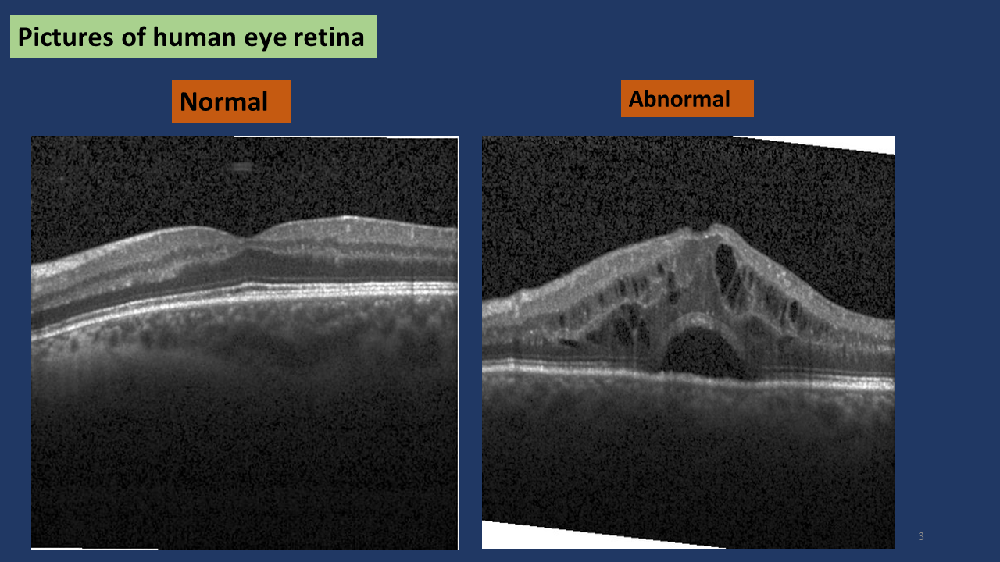
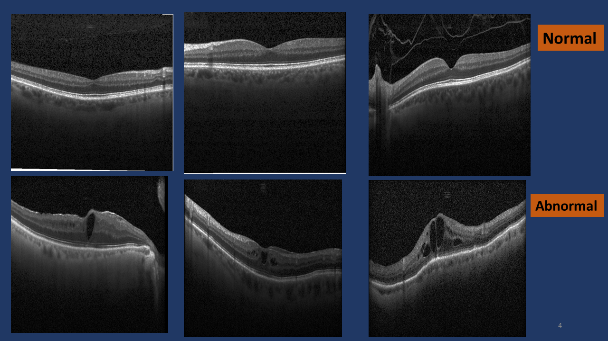
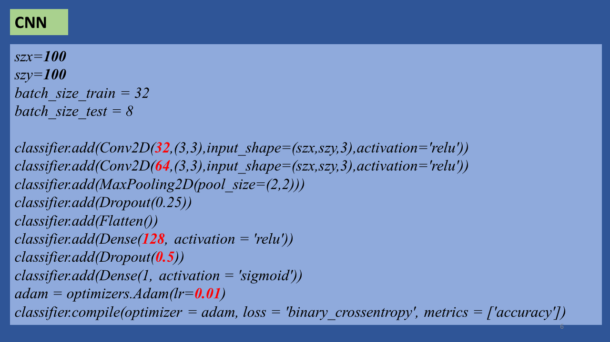
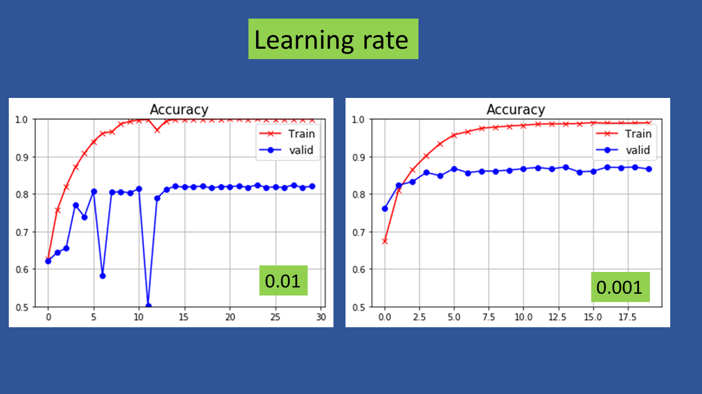
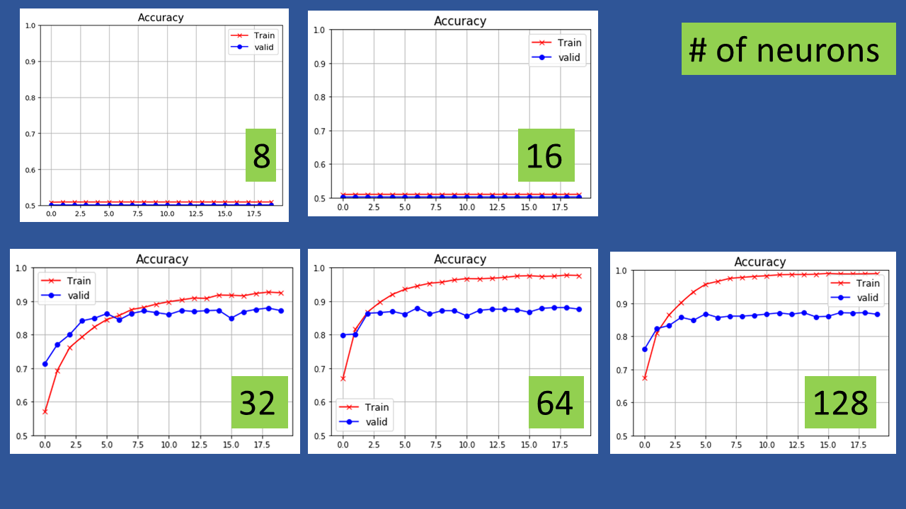
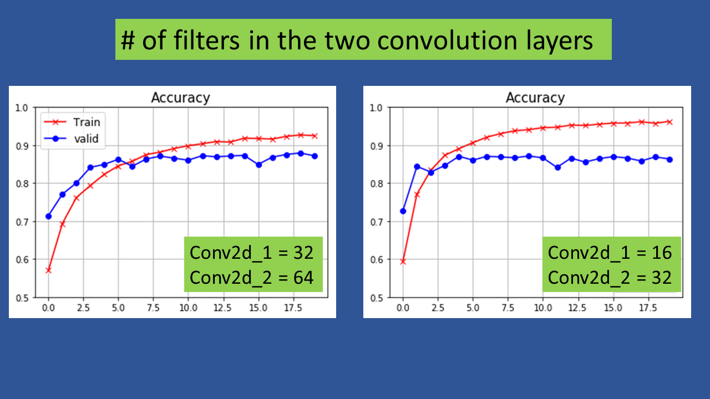
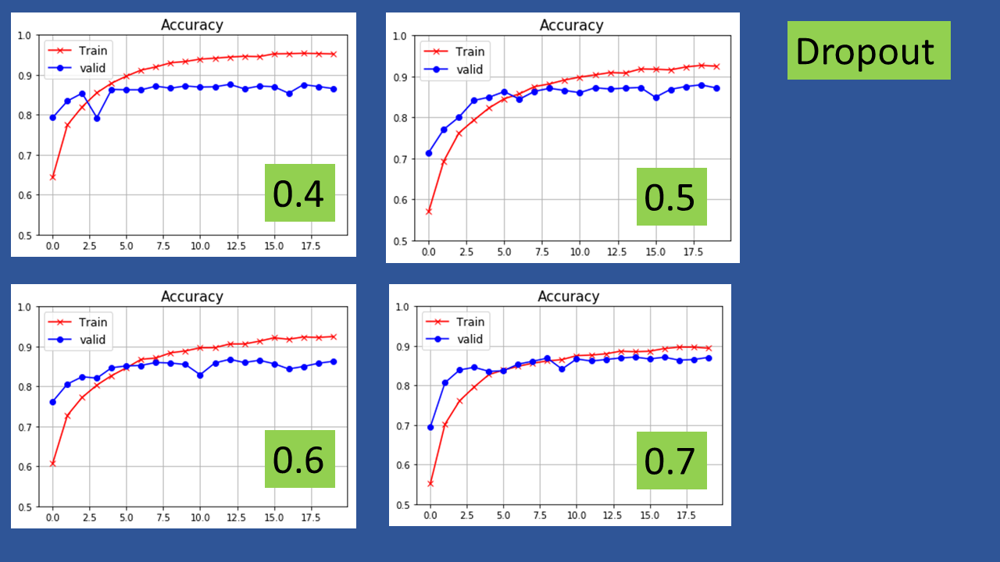
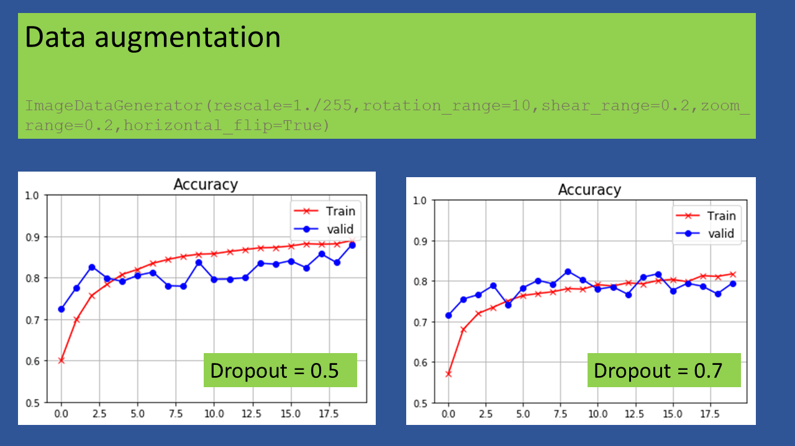

# OCT_image_classification
Binary classification of medical images using Convolutional Neural Network.

Optical Coherence Tomography (OCT) is a technique used in medical diagnosis of the human eye. OCT captures high resolution images of the cross section of retina. The data are downloaded from,

https://www.kaggle.com/paultimothymooney/kermany2018/

The dataset is balanced. There are 24000 images in each of the two classes. Out of these 75% are used for training and 6000 are used for testing. A simple Convolutional Neural Network (CNN) configuration is used.

The following figure compares a normal retina image to abnormal retina image.  Clearly the abnormal images have perforations which distinguishes it from the normal retina images.

  

 The following figure compares three images of each class. 

  

  

The following shows the basic configuration of CNN used in this work. There are two convolutional layers and one dense layer. The sensitivity of the accuracy to the learning rate, the number of neurons in the dense layer, the number of filters, the dropout rate and data augmentation is explored.

 

 
The following shows the sensitivity to learning rate.

 

 

 

The number of neurons along with the number of hidden layers quantify the capacity of the neural network. Higher the number of neurons (and hidden layers) higher the number of free (tunable) parameters of the neural network model. Given a fixed amount of training data, higher number of parameters tend to overfit the training data. An overfit model tends to perform very well on the training data but fails miserably on the test data. The generalization error of such models is high. An overfit model has low bias and high variance.

 

The following figure shows the sensitivity of the accuracy to the number of neurons. For the configuration with 8 and 16 neurons there are too few neurons for the model to fit to the observations. Hence the accuracy is too low. The model does not have enough capacity (i.e. flexibility)  to fit the data. The low number of neurons result in an underfit model. The high bias leads to a low accuracy (0.5). The other extreme is realized with N = 128. The training accuracy is close to 1 while the validation accuracy is ~ 0.88. The gap of ~0.12 between the training and validation accuracy quantifies the overfitting. Therefore the optimal value of N is between 16 and 128. Decreasing the number of neurons to 32 gives a best result in that the overfitting decreases. This is quantified by the decrease in gap between the training and validation accuracy. The training accuracy is 0.92 and validation accuracy is 0.88. Consquently N = 32 is the best choice for this problem. The overfitting is not eliminated completely with N = 32. Decreasing N from 128 to 32 decreases the variance of the model. The experiments that follow use N = 32.

 

  

The following explores the sensitivity of accuracy to the number of filters. The choice of (32,64) is better because the overfitting is less accute.

 

 

The issue of overfitting in neural networks can be addressed with another technique known as *dropout*. In this technique a particular percentage of outputs from  a layer are randomly switched off (i.e. dropped out). For example a drop out rate of 0.5 results in switching off of 50% of the 32 neurons in the dense layer. For each iteration, the particular neurons that are dropped off are chosen randomly. The drop out is applied after the non-linear activation function. However, in case of ReLU applying the drop out before or after the activation function produces the same result. Drop out effectively decreases the capacity of the network. The following figure explores the sensitivity of accuracy to the magnitude of dropout. The drop out rate of 0.7 is the best out of different values used because the gap between training and validation accuracy is minimum.

 

 

 
So far two different techniques to decrease overfitting were explored. The first one was explicitly decreasing the number of neurons while the second one (drop out) has the effect of decreasing the capacity of the network. These techniques are types of regularization which in general tends to decrease overfitting. Regularization adds a penalty term to the cost function. Regularization is equivalent to using a prior which ensures that the model parameters do not overfit to the data. In case of neural networks the parameters are the weights. Reducing the complexity of the model is one way of regularization. Imposing constraints on the parameters (eg. L1 or L2 regularization) is another way of regularization. This assumes that a fixed amount of data is available and one is supposed to build an optimal model.

 

It is possible to decrease overfitting by increasing the amount of data. This data has to be diverse which means that simply replicating existing data may not give good results. However collecting more data is non trivial for many problems. In case of image classification augmentation techniques can be used to increase the amount of data.  This can be achieved by rotating, fliping and shearing the existing images. The following explores the effect of data augmentation on accuracy. It is seen that a drop out of 0.5 combined with more data decreases the gap between training and validation accuracy. On the other hand using augmented data along with drop out of 0.7 leads to too much regularization (higher bias). Consequently both training and validation accuracy decrease to 0.8.

 

There is a debate as to whether increasing the amount of data should be called regularization. What is clear though is that increasing the amount of data leads to decrease in overfit.

# References

D. Kermany, K. Zhang, M. Goldbaum, “Labeled Optical Coherence Tomography (OCT) and Chest X-Ray Images for Classification”, Mendeley Data, v2

E. Swanson and J. Fujimoto,  “The ecosystem that powered the translation of OCT from fundamental research to clinical and commercial impact”. Biomed. Opt. Express 8, 1638-1664, 2017.

https://towardsdatascience.com/balancing-the-regularization-effect-of-data-augmentation-eb551be48374

https://stats.stackexchange.com/questions/295383/why-is-data-augmentation-classified-as-a-type-of-regularization

Saikat Biswas : How Regularization helps in data overfitting, *medium.com*, 2019.

https://www.analyticsvidhya.com/blog/2018/04/fundamentals-deep-learning-regularization-techniques/

Srivastava, Nitish & Hinton, Geoffrey & Krizhevsky, Alex & Sutskever, Ilya & Salakhutdinov, Ruslan. (2014). Dropout: A Simple Way to Prevent Neural Networks from Overfitting. Journal of Machine Learning Research. 15. 1929-1958. 

https://machinelearningmastery.com/dropout-for-regularizing-deep-neural-networks/

https://sebastianraschka.com/faq/docs/dropout-activation.html#:~:text=Typically%2C%20dropout%20is%20applied%20after,on%20the%20particular%20code%20implementation.

